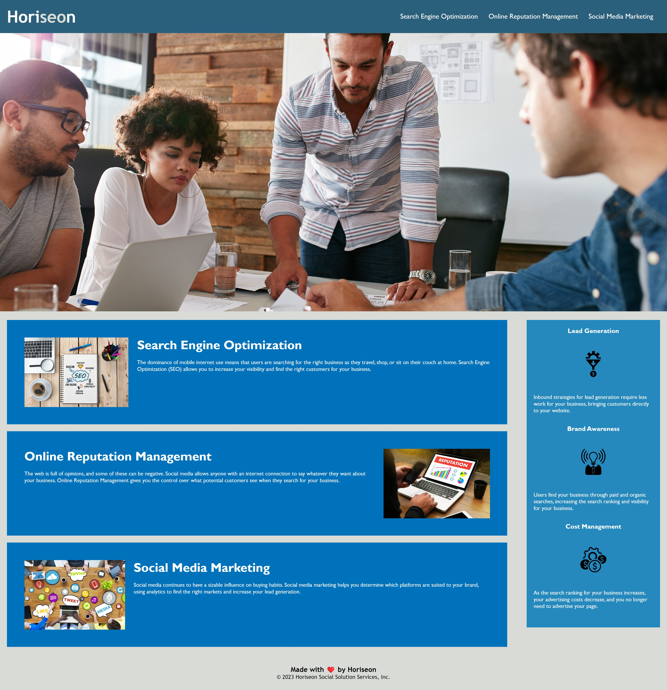

# Horiseon-Code-Refactor

## Description

This project was to refactor the code of the Horiseon website. Refactoring the code will make website more accessible to search engines and assistive technologies such as video captions, screen readers, and braille keyboards.

### Tasks Completed

* HTML elements were replaced with HTML semantic elements
* Added alt image attributes to image elements
* Consolidated css selectors that were redundant
* CSS stylesheet was reorganized to separate elements and classes
* A Descriptive Title was added

### Links


### Usage
Once deployed the application will be viewed as followed

```md

```


  
